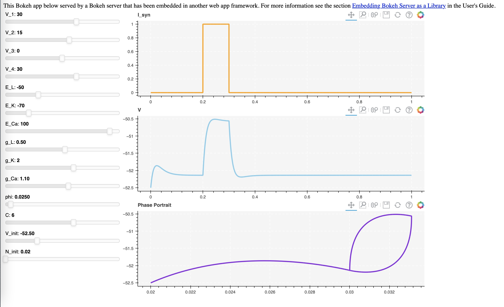

# neural-adjuster
 An interactive adjuster for tuning parametes of neural models

## Morris Lecar Model

An implementation of the Morris-Lecar Neuron

Descrition of files:

* `morris_slider.ipynb`  - A python interactive implementation of the Morris Lecar model. You can adjust parameters for the neuron model and get the output in real-time. 

* `morris_server.ipynb`  - A python interactive implementation of the Morris Lecar model. It will run in a server created under port:8888. You can change the port in the notebook if you are using different port for the Jupter Notebook(Jupyter Notebook will run under 8888 by default).

* `synapse_server.ipynb` - A python interactive implementation of the Synapse model.

* `flask_embed.py` - Run the script and you will get a server under port:8000. Go to `http://127.0.0.1:8000/` to use the interactive adjuster.

  