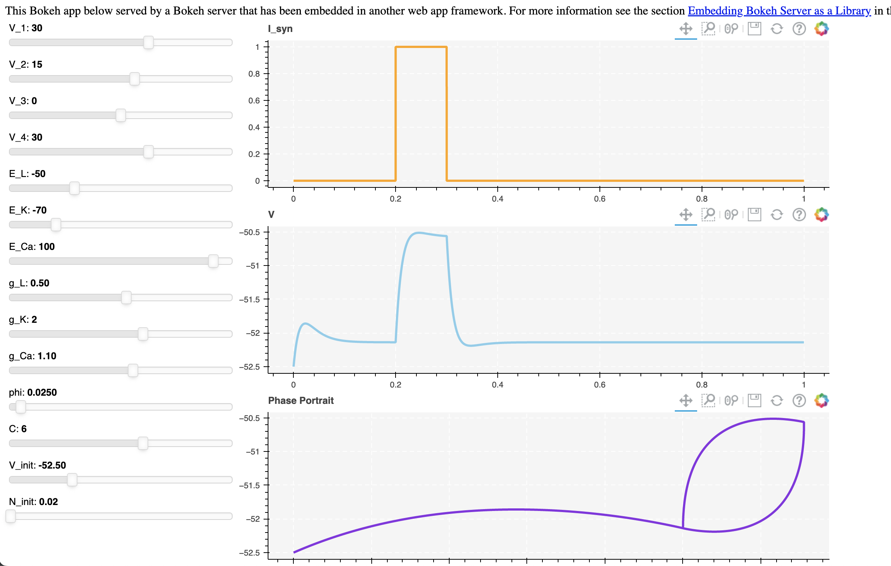

# Neural-adjuster

  	

 

  
  

- **Website**: https://boyuan.io/research/neural_adjuster/html/intro.html
- **Source**: https://github.com/boyuan99/neural-adjuster
- **Bug reports**: https://github.com/boyuan99/neural-adjuster/issues

This is a simple slider tool that allows you to understand how each parameter affects the neural response and to find the best parameter you want.

## Models

## An implementation of the **Morris-Lecar** Neuron

Descrition of files:

* `morris_slider.ipynb`  - A python interactive implementation of the Morris Lecar model. You can adjust parameters for the neuron model and get the output in real-time. 

* `morris_server.ipynb`  - A python interactive implementation of the Morris Lecar model. It will run in a server created under `port:8888`. You can change the port in the notebook if you are using different port for the Jupter Notebook(Jupyter Notebook will run under 8888 by default).

* `synapse_server.ipynb` - A python interactive implementation of the Synapse model.

* `flask_embed.py` - Run the script and you will get a server under port:8000. Go to `http://127.0.0.1:8000/` to use the interactive adjuster.

  

### An implementation of the **Hodgkin Huxley** Neuron

`hodgkin_slider.ipynb`  - A python interactive implementation of the **Hodgkin Huxley** model. You can adjust parameters for the neuron model and get the output in real-time. 

### An implementation of the Integrate and Fire Neuron

`IAF_slider.ipynb` - A python interactive implementation of the **Integrate and Fire** model. 

### An implementation of the Leaky Integrate and Fire Neuron

`LIF_slider.ipynb` - A python interactive implementation of the **Leaky Integrate and Fire** model. 